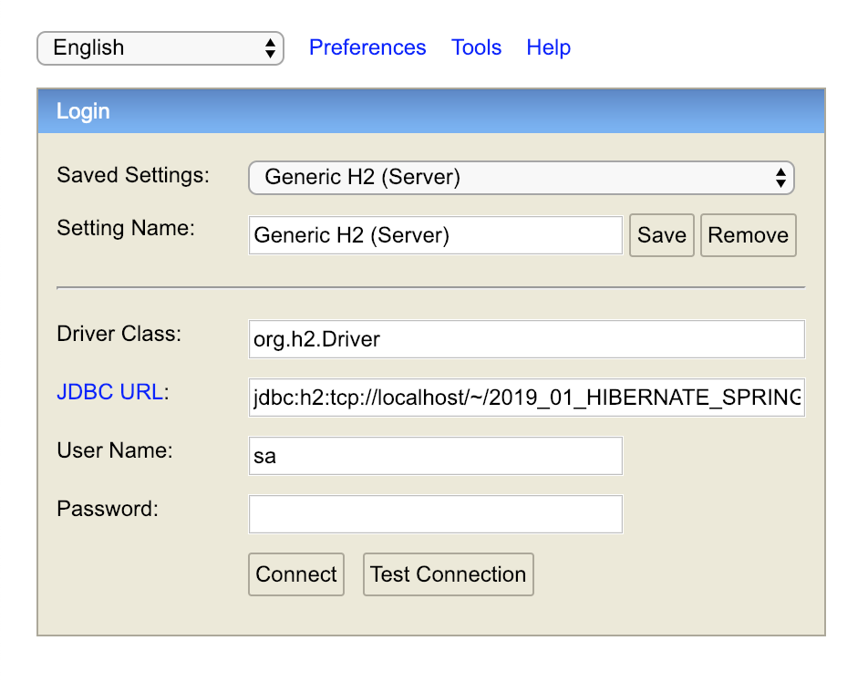
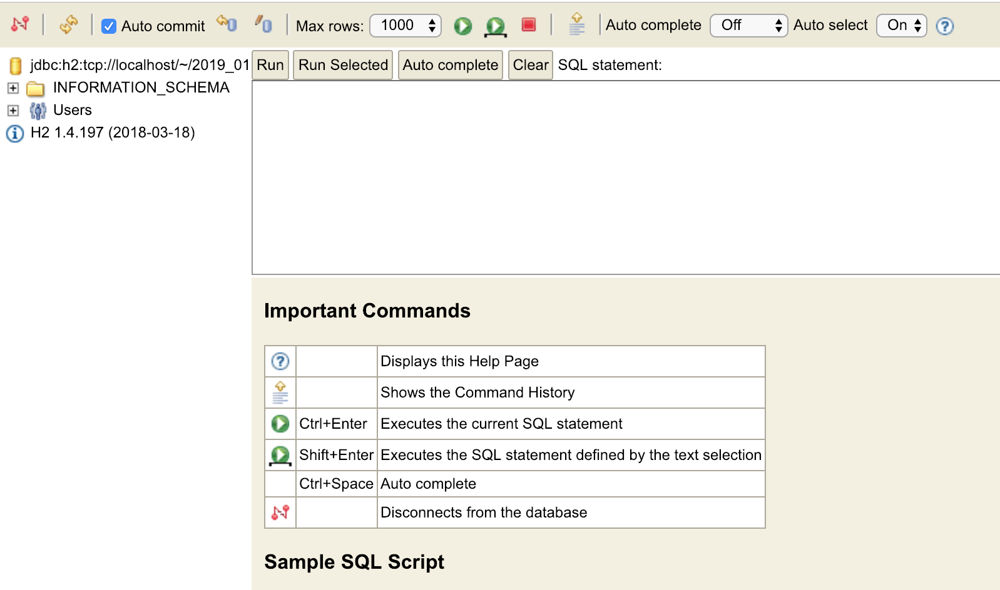
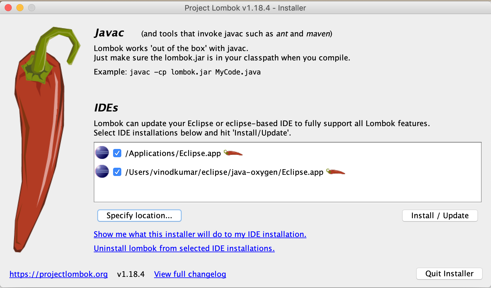

# Hibernate with Spring

Client: HPE, Bangalore 

Duration: 5 days

From: 25th Jan 2019

To: 31st Jan 2019


<table>
<tr>
    <td>
        <a href="http://bit.ly/2D9pxjW" target="_blank">
        
        </a>
    </td>
    <td>
        <a href="https://www.udemy.com/mongodb-fundamentals/?couponCode=FIRST500" target="_blank">
        
        </a>
    </td>
</tr>
</table>


### Download h2 database from here:

<a href="http://www.h2database.com/h2-2018-03-18.zip">h2 database</a>

### How to use h2 database?

* Unzip the downloaded file `h2-2018-03-18.zip`
* Go to *h2-2018-03-18/bin* folder
* Windows - double click the *h2.bat* file
* MacOS/Linux - run the *h2.sh* in a terminal

This will start a RDBMS server and also opens a client application in a browser.


If the server doesn't start due to port issues, create/update the *.h2.server.properties* file in the home directory with the following (change the webPort to some other unused port): 

```
0=Generic H2 (Server)|org.h2.Driver|jdbc\:h2\:tcp\://localhost/~/2019_01_HIBERNATE_SPRING_HPE|sa
webAllowOthers=false
webPort=8082
webSSL=false
```



* Select **Generic H2 (Server)** from the *Saved settings* dropdown
* Driver class - **org.h2.Driver** 
* URL - jdbc:h2:tcp://localhost/~/2019_01_HIBERNATE_SPRING_HPE
* Username - sa (you may change if you want)
* Password - (empty by default, you may change if you want)

Click the **Connect** button.




### Download the database script from here:

<a href="http://vinod.co/resources/dbscript.zip">DB Script (zip file)</a>


### Command to import tables and data from the script file in h2 database:

```sql
runscript from 'ABSOULTE_PATH_TO_THE_DBSCRIPT.SQL_FILE'
```

FOR EXAMPLE:

```sql
runscript from '/Users/vinodkumar/Desktop/dbscript.sql'
```

### For MySQL download the script from here:

<a href="http://kelutral.com/vinod_co_backup/hibernate/Resources/DB%20Scripts/MySQL_Northwind.sql" target="_blank">MySQL_Northwind.sql (SQL file)</a>


The tables and relationships among the same is explained here:


### Download libraries (JAR files) for Hibernate and Spring framework from here:

<a href="https://vinod.co/resources/hibernate-spring-jars.zip">Hibernate and Spring JARs</a> (Download this only if you do not want to use Maven)


### Download Apache Tomcat 8.5 from here:

<a href="http://mirrors.estointernet.in/apache/tomcat/tomcat-8/v8.5.37/bin/apache-tomcat-8.5.37.zip">Apache Tomcat 8.5.37</a>

### or download the older Tomcat 8 from here:

<a href="https://archive.apache.org/dist/tomcat/tomcat-8/v8.0.9/bin/apache-tomcat-8.0.9.zip">Apache Tomcat 8.0.9</a> (This has reached  ***end of life*** and you should upgrade to 8.5.x)

### Hibernate dependency (Maven)

```xml
<dependency>
    <groupId>org.hibernate</groupId>
    <artifactId>hibernate-core</artifactId>
    <version>4.3.11.Final</version>
</dependency>
```

### Sample hibernate.cfg.xml

```xml
<?xml version='1.0' encoding='utf-8'?>

<!DOCTYPE hibernate-configuration PUBLIC
"-//Hibernate/Hibernate Configuration DTD//EN"
"http://hibernate.sourceforge.net/hibernate-configuration-3.0.dtd">

<hibernate-configuration>
	<session-factory>
		<property name="hibernate.connection.driver_class">org.h2.Driver</property>
		<property name="hibernate.connection.url">jdbc:h2:tcp://localhost/~/2019_01_HIBERNATE_SPRING_HPE</property>
		<property name="hibernate.connection.username">sa</property>
		<property name="hibernate.connection.password"></property>

		<property name="show_sql">true</property>
		<property name="format_sql">true</property>
		<property name="dialect">org.hibernate.dialect.H2Dialect</property>
	</session-factory>
</hibernate-configuration>

```

### Lombok dependencies (for simplifying entity classes by auto-generating costructors, getters, setters etc.)

```xml
<dependency>
    <groupId>org.projectlombok</groupId>
    <artifactId>lombok</artifactId>
    <version>1.18.4</version>
    <scope>provided</scope>
</dependency>
```

### How to use lombok?

* Windows - Double click the `lombok-1.18.4.jar`
* MacOS/Linux - run the command `java -jar lombok-1.18.4.jar` from a terminal after `cd` into the directory where the JAR file is present
    * Here is the location of the JAR - `~/.m2/repository/org/projectlombok/lombok/1.18.4/lombok-1.18.4.jar`

The following screen appears:



If your eclipse is not listed, click the *Specify location...* button, and choose the *eclipse.ini* file of your eclipse. Then click the *Install/Update* button. Finally, click the *Quit installer* to exit the setup.

Re-launch *eclipse* to use lombok.

### Spring minimum dependencies

```xml
<dependency>
    <groupId>org.springframework</groupId>
    <artifactId>spring-context</artifactId>
    <version>4.3.14.RELEASE</version>
</dependency>
```

### Sample context.xml

```xml
<?xml version="1.0"?>

<beans xmlns="http://www.springframework.org/schema/beans"
	xmlns:context="http://www.springframework.org/schema/context"
	xmlns:xsi="http://www.w3.org/2001/XMLSchema-instance"
	xsi:schemaLocation="http://www.springframework.org/schema/beans
		http://www.springframework.org/schema/beans/spring-beans.xsd
		http://www.springframework.org/schema/context
		http://www.springframework.org/schema/context/spring-context.xsd">

	<bean name="" class="" >
	</bean>

</beans>
```

### Apache DBCP dependencies:

```xml
<dependency>
    <groupId>org.apache.commons</groupId>
    <artifactId>commons-dbcp2</artifactId>
    <version>2.5.0</version>
</dependency>
```

### Spring JDBC dependencies

```xml
<dependency>
    <groupId>org.springframework</groupId>
    <artifactId>spring-jdbc</artifactId>
    <version>4.3.14.RELEASE</version>
</dependency>
```

### Spring ORM (for hibernate) dependencies

```xml
<dependency>
    <groupId>org.springframework</groupId>
    <artifactId>spring-orm</artifactId>
    <version>4.3.14.RELEASE</version>
</dependency>
```

### AspectJ (for Spring AOP) dependencies

```xml
<dependency>
    <groupId>org.aspectj</groupId>
    <artifactId>aspectjrt</artifactId>
    <version>1.8.13</version>
</dependency>
<dependency>
    <groupId>org.aspectj</groupId>
    <artifactId>aspectjweaver</artifactId>
    <version>1.8.13</version>
</dependency>
```

### Spring MVC dependencies

```xml
<dependency>
    <groupId>org.springframework</groupId>
    <artifactId>spring-webmvc</artifactId>
    <version>4.3.14.RELEASE</version>
</dependency>
```


### Jackson dependencies

```xml
<dependency>
    <groupId>com.fasterxml.jackson.core</groupId>
    <artifactId>jackson-core</artifactId>
    <version>2.9.5</version>
</dependency>
<dependency>
    <groupId>com.fasterxml.jackson.core</groupId>
    <artifactId>jackson-databind</artifactId>
    <version>2.9.5</version>
</dependency>
<dependency>
    <groupId>com.fasterxml.jackson.core</groupId>
    <artifactId>jackson-annotations</artifactId>
    <version>2.9.5</version>
</dependency>
```
